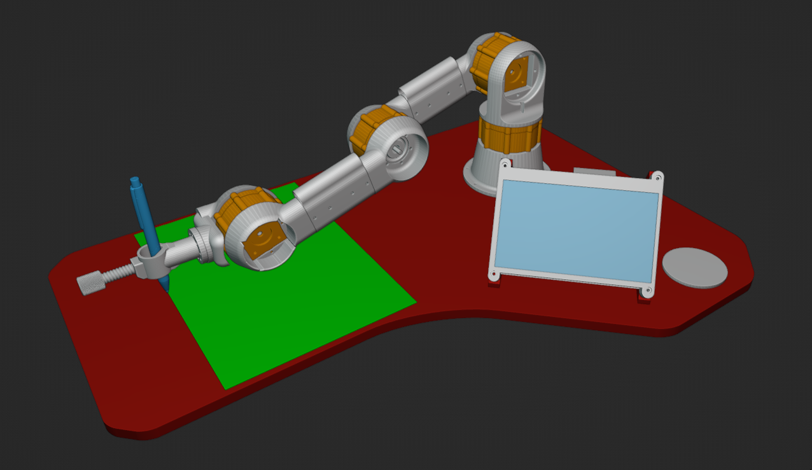

<!-- markdownlint-configure-file { "MD004": { "style": "consistent" } } -->
<!-- markdownlint-disable MD033 -->

#

<div align="center">

```py

" ██████╗  ██████╗ ██████╗  ██████╗ " ██╗███╗   ██╗██╗  ██╗███████╗██████#╗
 " ██╔══██╗██╔═══██╗██╔══██╗██╔═══██╗" ██║████╗  ██║██║ ██╔╝██╔════╝██╔══██#╗
 " ██████╔╝██║   ██║██████╔╝██║   ██║" ██║██╔██╗ ██║█████╔╝ █████╗  ██████#╔╝
 " ██╔══██╗██║   ██║██╔══██╗██║   ██║" ██║██║╚██╗██║██╔═██╗ ██╔══╝  ██╔══██#╗
 " ██║  ██║╚██████╔╝██████╔╝╚██████╔╝" ██║██║ ╚████║██║  ██╗███████╗██║  ██#║
 " ╚═╝  ╚═╝ ╚═════╝ ╚═════╝  ╚═════╝ "#╚═╝╚═╝  ╚═══╝╚═╝  ╚═╝╚══════╝╚═╝   ╚═╝

```

</div>

> [!CAUTION]
> **This project is old, unmaintained and very unfinished!**
>
> Starting as a year-long final project for Year 12 Systems Engineering, 
roboinker has been dumped to this repo in its last working state (Sept, 2025). 
It is highly unlikely that anything here works 
(particularly without the hundreds of dollars worth of school-expensed materials), 
but feel free to take a peak regardless.
>
> Additionally, a ~100 page report was produced algonside this project. 
Big thanks to 'teach for being chill and letting it slide till the last week ✌️

## Description

This project contains all of the software for a 3D-printed, 2-DOF robotic arm that draws images
with a pen using AI and speech recognition. The repo provides a
[GUI](https://github.com/nullisnotthere/roboinker/blob/main/src/rpi/frontend/tft_ui.py) 
to demonstrate the backend processes in action.



## Usage Guide

This software runs on a **Raspberry PI (5)** and an **Arduino Uno** configured with a
**CNC shield**
and **DRV8825 stepper drivers**.
However, the visualisation code can be run on any machine given the correct
configurations and required dependencies.

### Run the visualiser UI code

```bash
git clone https://github.com/nullisnotthere/roboinker
cd roboinker/
pip install -r requirements.txt
python src/rpi/frontend/tft_ui.py
```

## Configuration

This software depends on two (free) external AI web apps:

1. [Deep AI](https://deepai.org/) for prompt processing.
[2. Microsoft's Bing AI](https://www.bing.com/images/create) for image generation.

An account will need to be created for both of these services to
gain access to the required API keys and Authorization Tokens.

A `.env` file should be configured for each service's
authentication keys.

```env
# Sensitive environment variables for Deep AI
DEEP_AI_API_KEY='Your Deep AI API key'

# Sensitive environment variables for Bing
BING_EMAIL='Your Bing email'
BING_USERNAME='Your Bing username'
BING_PASSWORD='Your Bing password'
```

### How to get Deep AI API Key

1. [Sign up to Deep AI](https://deepai.org/)
2. Navigate to [your dashboard](https://deepai.org/dashboard/profile)
3. Copy your API key to `.env`

## Code Flow

1. Transcribe speech from microphone with
   [Vosk API](https://github.com/alphacep/vosk-api/tree/master/python)
2. Extract key ideas from voice prompt using a [Deep AI](https://deepai.org/)
   [API wrapper](https://github.com/nullisnotthere/roboinker/tree/main/src/rpi/backend/prompt_processing/deep_ai_wrapper)
3. Tune the prompt for image generation and pass it to a [Dream AI](https://dream.ai/)
   [API wrapper](https://github.com/nullisnotthere/roboinker/blob/main/src/rpi/backend/image_generation/dream_api_wrapper.py)
4. Convert the generated image to drawable contours using
   [various algorithms](https://github.com/nullisnotthere/roboinker/blob/main/src/rpi/backend/image_processing/image_processing.py)
5. Using the contour points, calculate and store the robotic arm's motor angles
   and drawing instructions in the `data/output.motctl` file (for more info see
   [.motctl documentation](https://github.com/nullisnotthere/roboinker/blob/main/MOTCTL.md)
6. Visualise the robotic arm's drawing process using
   [inverse kinematics](https://github.com/nullisnotthere/roboinker/tree/main/src/rpi/backend/ik)

## References
 
- [Bing AI image generation wrapper](https://github.com/DedInc/bingart)
- [Deep AI API wrapper](https://github.com/5eroo/DeepAI-Wrapper)
- [Inverse Kinematics](https://github.com/vishwas1101/Inverse-Kinematic-Robot-Arm/blob/master/InverseKinematics/IK_Simulation.py)
